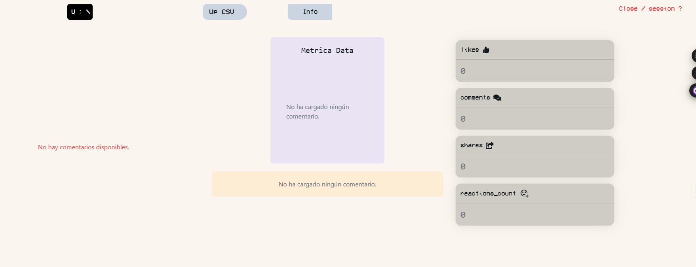
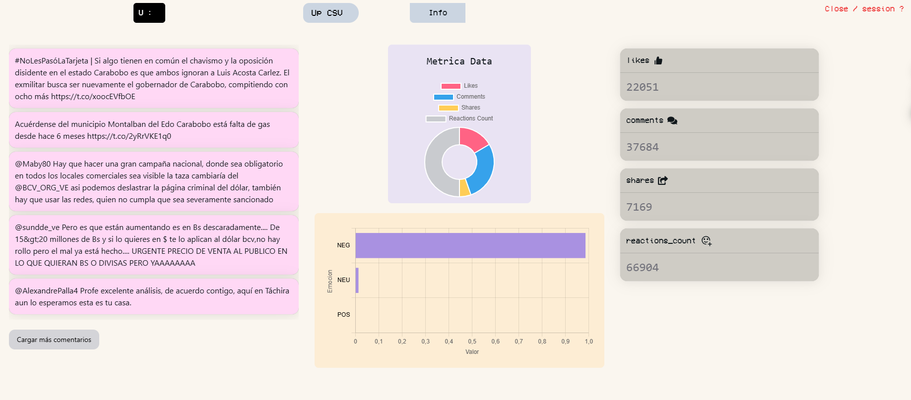

# Technical Test

Prueba técnica de desarrollo de un frontend con interacción de gráficas y consultas a una API

## Tecnologías Utilizadas

Este proyecto cuenta con:

- Vite
- React
- Tailwind CSS
- Chart.js
- Next UI

## Ejecutar

Clonar el repositorio

```bash
git clone https://github.com/Tghoz/technical-test.git

cd my-projec

npm install

npm run dev
```

## Cómo Usar

Se debe subir un archivo CSV que contenga las siguientes columnas:

* `text`
* `likes`
* `comments`
* `shares`
* `reactions_count`

Cada texto se podrá ver en una lista para seleccionar, visualizando la cantidad de likes, comentarios y shares, además de utilizar la API de beto-emotion-analysis.






## Nota

No pude completar el inicio de sesión debido a limitaciones de tiempo.


## 🔗 Links

[](https://www.linkedin.com/in/govanny-travieso-87b864277/)
